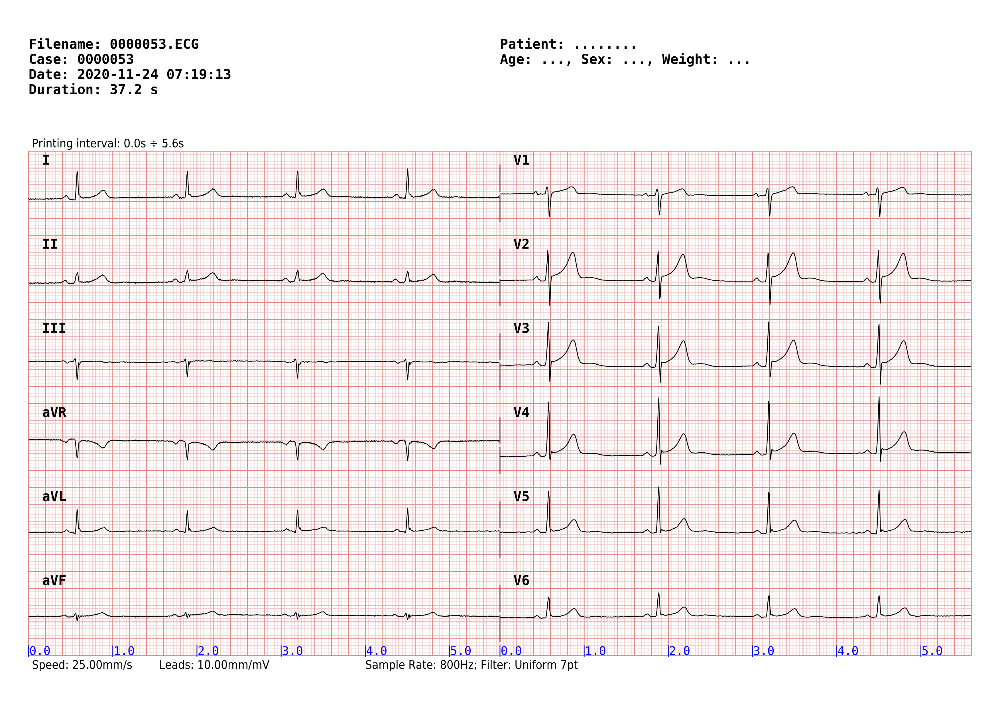

# ecg2pdf

Python program to plot electrocardiogram graphs from files 
produced by the **Contec ECG90A** device.

The program relies on the Pyhon modules **ecg\_contec.py** and 
**ecg\_scp.py**, which should be present in the same directory 
or installed as system-wide modules. It requires also the 
libraries Numpy, Scipy and Reportlab. The program was developed 
and tested with Python 3.7.

This is a minimal usage example:

```
./ecg2pdf 0000053.ECG
```

You can ask for a PNG file instead, that will rendered at 300 dpi:

```
./ecg2pdf --png 0000053.ECG
```

The command above will produce the following output: 




## Command line options

The program can filter the data with a notch (band-stop) filter 
e.g. to remove noise generated from AC powered devices in the 
nearby, you can choose to plot only some leads starting from a 
specified time, use a different format, etc. Here an example:

```
./ecg2pdf --notch 40 --leads 1,2,3,4,5,6 --time0 4.2 --format 6x1 0000053.ECG
```

You can ask for complete command line help:

```
./ecg2pdf -h
usage: ecg2pdf [-h] [--png] [--speed mm/s] [--ampli mm/mV] [--time0 TIME0]
               [--notch Hz] [--lowpass Hz] [--format ROWSxCOLS] [--leads LIST]
               [-y]
               filename [filename_out]

Parse an ECG90A file and create a PDF or PNG graph.

positional arguments:
  filename            Contec ECG90A file to read
  filename_out        output PDF or PNG file to write (default append .pdf or
                      .png to filename)

optional arguments:
  -h, --help          show this help message and exit
  --png               output a PNG raster file instead of PDF (default no)
  --speed mm/s        speed in mm/s (default 25.0)
  --ampli mm/mV       leads amplitude in mm/mV (default auto)
  --time0 TIME0       plotting start time, in seconds (default 0.0)
  --notch Hz          add a band-stop filter at specified Hz (default None)
  --lowpass Hz        add a lowpass filter at specified Hz (default None)
  --format ROWSxCOLS  use specified print format (default 6x1)
  --leads LIST        comma separated list of leads to print (default 1,..,12)
  -y, --overwrite     overwrite existing output files (default no)
```

## More on filters

If required by the **--notch** option, the program uses the 
scipy.signal.lfilt() to apply a band-stop filter builded with 
scipy.signal.iirnotch(). This filter is intended to attenuate 
the noise caused e.g. by AC mains at 50 Hz or 60 Hz. The filter 
is 6 Hz wide (i.e. the -3 dB threshold is set at +/- 3 Hz the 
requested frequency, where a -3 dB attenuation means to half the 
noise power.

If required by the **--lowpass** option, the program uses the 
scipy.signal.filtfilt() to apply a Butterworth filter builded 
with scipy.signal.butter(). The filtfilt() is better than 
lfilter() because it does not shift the phase of the graph and 
it does not generate artifacts at the edges. Beware the 
filtfilt() performs two passes (forward and backward), so the 
order used is generally the half the one used with lfilter().

The program generates one plot pitch every 0.2 mm on the X axis; 
if that pitch includes more than 4 sample points, an 
uniform_filter() is applied over the pitch segment. This filter 
does not alter the plot shape, because it works under the size 
of each plot segment, it just uses an uniformed value instead of 
the center one.

## The ecg_contec.py and ecg_scp.py Python modules

The **ecg\_contec.py** Python module was developed to parse the 
ECG files produced by the **Contec ECG90A** electrocardiograph 
device. Basically it parses the header of the file and it reads 
the 12 leads data into an array; it can dump a CSV or EDF file. 
The **ecg\_scp.py** is a support module used to convert ECG data 
into the **SCP-ECG** format.

This is an example on how to use the **ecg\_contec** module:

```
import ecg_contec as contec
ecg = contec.ecg('0000037.ECG')
ecg.export_csv(overwrite=True, as_millivolt=False, cols=12)
```

## Web References

* Contec ECG90A Electrocardiograph - ECG File Format
  * https://www.rigacci.org/wiki/doku.php/tecnica/misc/contec_ecg_file_format
